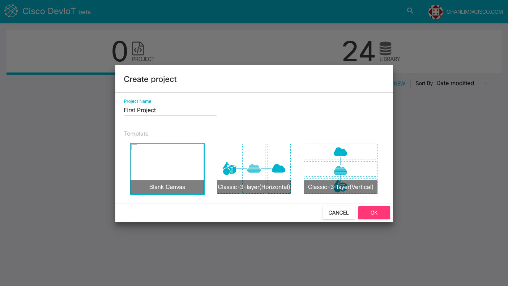
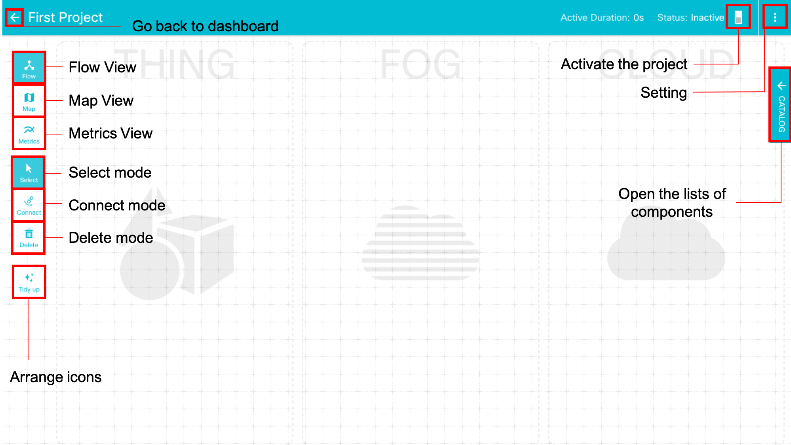
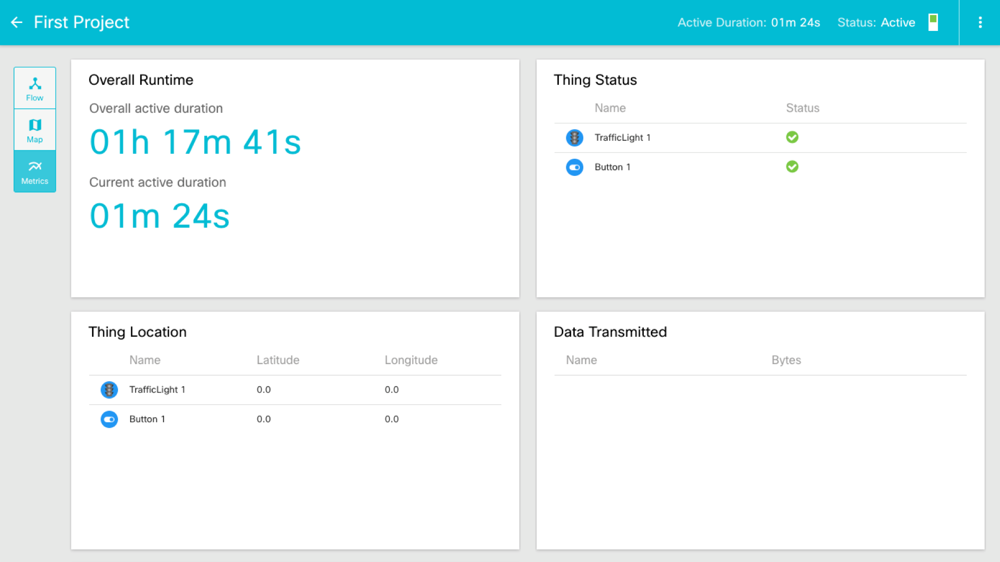

# Create a new project
By clicking the 'CREATE NEW' button, you can create a new project.
On the popup window, write the name of a new project and choose a template of projects. You can change the template later.

Click the created project, then you can see a workspace page for the project. This is the place where you can build your program. The details to build the program are explained in the next page.

### View
There are 3 views on the workspace page. Each view shows different aspects of the project. You can select the view by clicking the top 3 buttons on the left side.

* **Flow View**: Flow view is the **default** view in workspace. Flow View shows the workspace for building the program.
* **Map View**: Map View shows the location of each component on a map.
* **Metrics View**: Metrics View shows the statistics of the project like active duration, the status, and location of components. The following figure is the workspace in Metrics View.

  

### Mode

There are three modes in **Flow View**. Each mode is used for modifying the project.

* **Select mode**: The **default** mode. You can drag-and-drop components in this mode. If there is one Fog component, the connection is automatically generated.
* **Connect mode**: You can connect two components in Connect mode. You can only connect between a Fog component and a non-Fog component. You need to double-click icons to connect them.
* **Delete mode**: You can delete components from the project. Components will be removed by clicking red 'x' buttons.

### Button

* **Tidy up**: 'Tidy up' button arranges all icons on your workspace.
* **Clear**: 'Clear' button is shown only on **Delete mode**. It removes all icons. You can't undo it. BE CAREFUL!