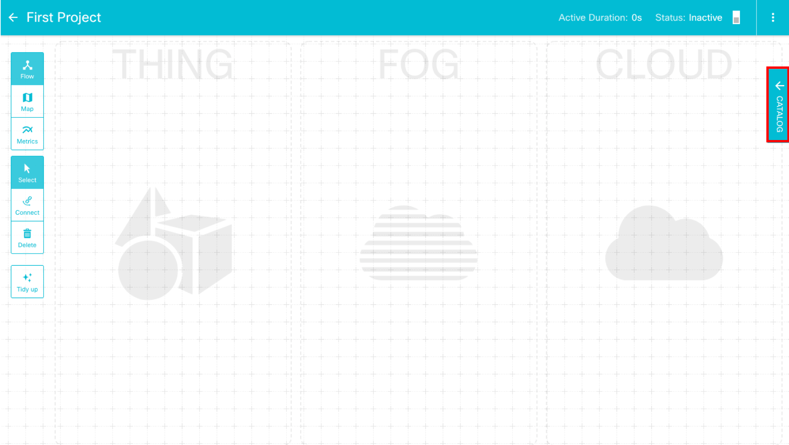
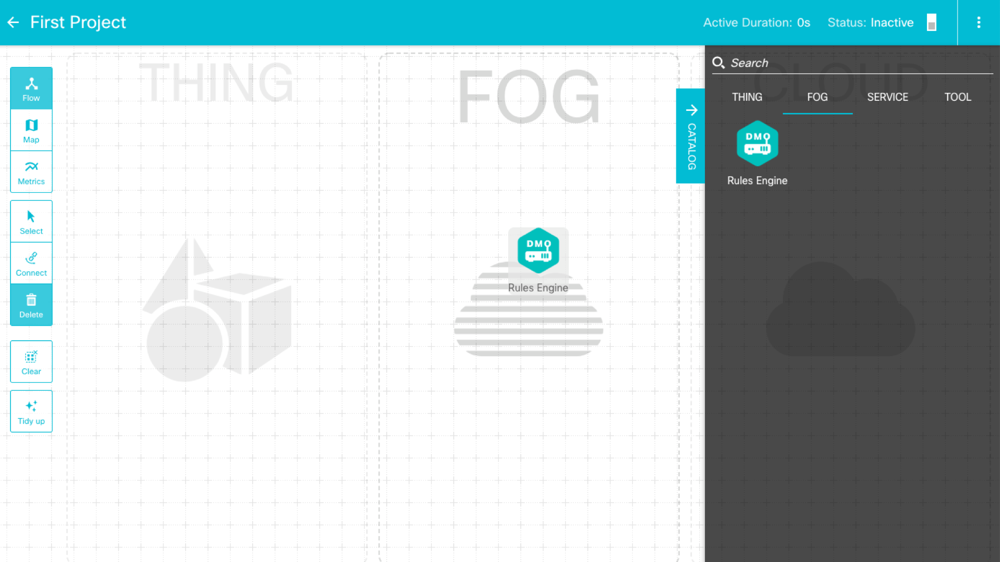
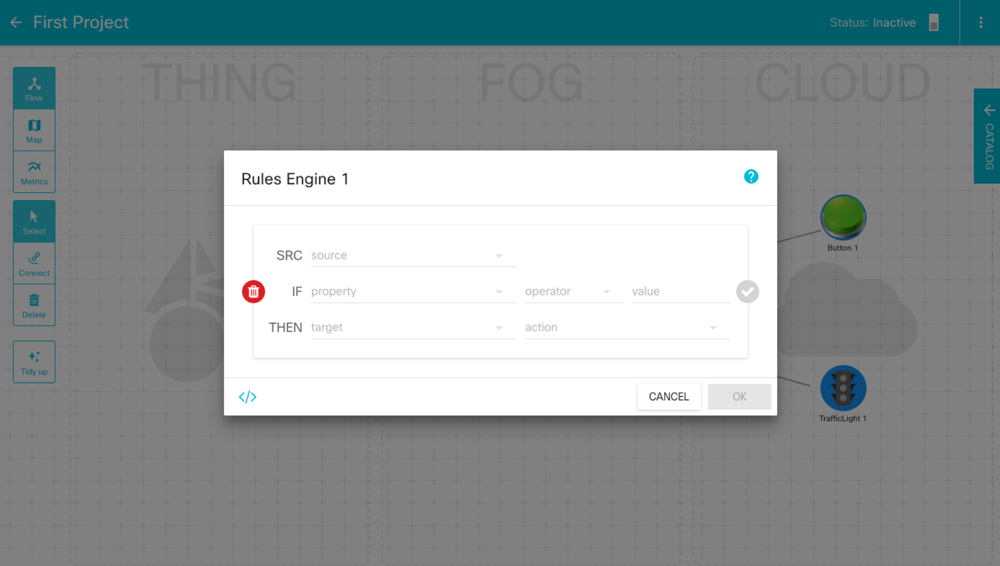
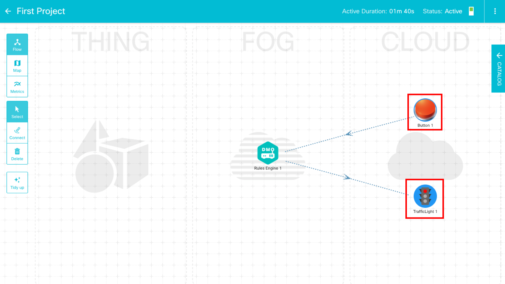

# Build your first Hello World app
Let's make your first program in DevIoT! It is o You need an only mouse to make a program in DevIoT.

In this section, you will build a simple program that a traffic light turns the green light on by pressing a button and the red light on the traffic light is turned on by releasing the button. Let's start from **Flow View** in your **workspace** page and follow these 5 steps. 

### 1. Click the 'Catalog' button

### 2. Drag-and-Drop 'Rules Engine' in FOG, and 'Button' nand 'TrafficLight' in TOOL from the catalog tab

* The project should have at least one 'Rules Engine' component determining the logic.

### 3. Click the 'Rules Engine' and set the logic

1. Set source(SRC) as 'Button 1', value as 'released', target as 'TrafficLight 1', and action as 'greenOn'.
2. Set same source and target with 1, and value as 'pressed' and action as 'redOn'.  
* There is no priority between rules, so you should be careful not to set inconsistent rules.

### 4. Activate your project by clicking the switch on the horizontal bar

* If the project is not activated, the program does not work at all.

### 5. Test your program

1. See whether the color of the button is the same as that of the traffic light. A released button is green and a pressed button is red.

* When the DevIoT server communicates with each component, the solid line connected to the component should become the dotted line. If the solid line is not converted to the dotted line, there might be a problem with the connection or the logic.

This 30-second video shows the complete procedure.

It is not an IoT program, but just the program controlling components on the web yet. But if each component is a physical device, it becomes an IoT program. In the next learning labs, you will learn how to connect IoT devices to DevIoT. After you connect devices to DevIoT, you can build complete IoT programs in the same way.

## Conclusion
Now you understand what IoT is and how to use DevIoT. DevIoT really doesn't require to write any lines of code unless you want to create a new kind of sensors with SDK. You can easily and swiftly build your program through DevIoT. Once you are able to make a program in DevIoT, you are ready to make an IoT program. 

Let's learn how to connect IoT devices in the next labs.