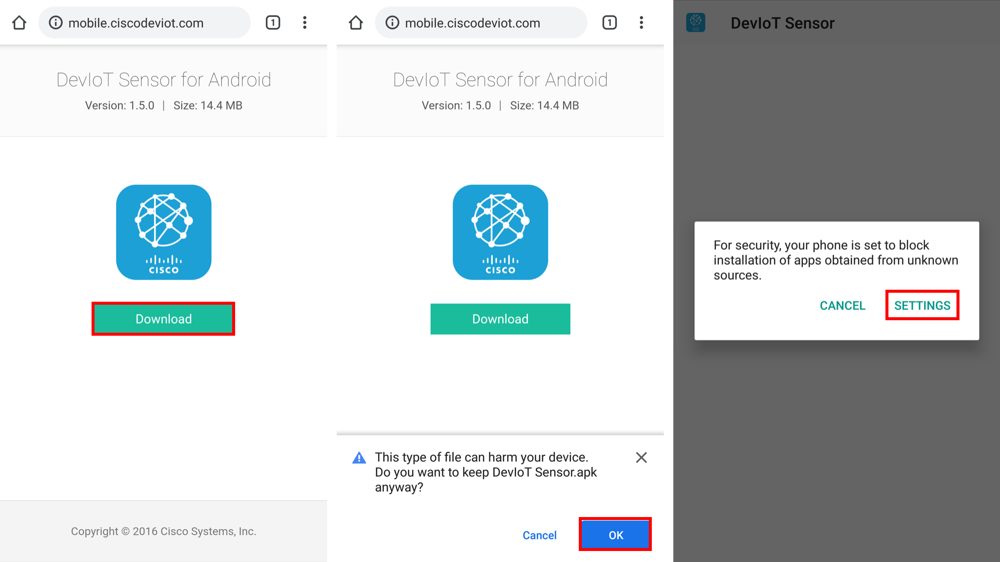
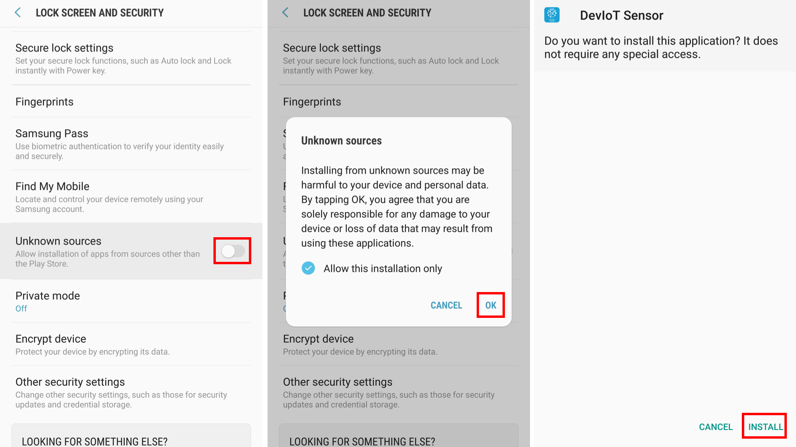
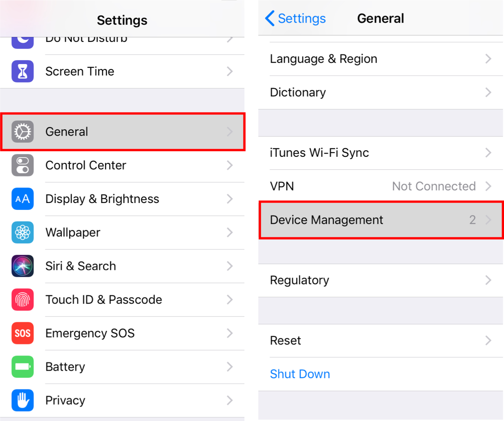
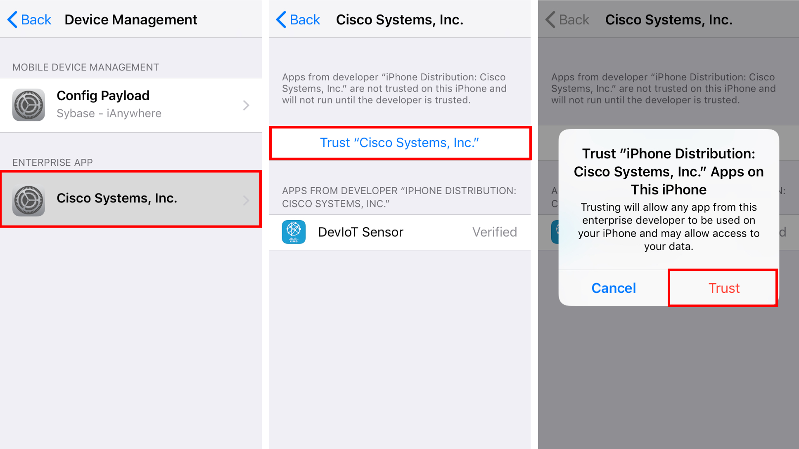
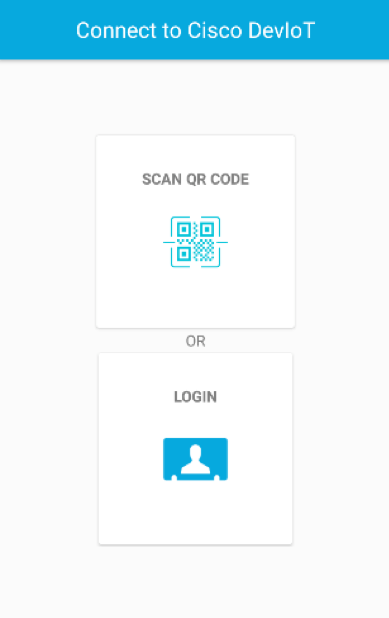

# Introduction to DevIoT

Completion time: 10 mins

## Objectives
The objective of this lab is to learn how to:
1. Learn how to connect mobile devices to DevIoT
2. Build an IoT program using a smartphone

## Download and Install the DevIoT app
DevIoT provides the Android and iOS app. You can download the app at [https://bit.do/deviot](https://bit.do/deviot) or [http://mobile.ciscodeviot.com/](http://mobile.ciscodeviot.com/).

### Android
Since this app is not on Play Store, you will download an apk file and install it.

You will need to allow the installation in settings. (Settings > Lock Screen and security > Unknown sources) It can vary accoring to the version of Android or the maker.

You can refer to the following images captured on Android 7.0 "Nougat".

### iOS
As you click the 'Download' button and the 'Install' button on the popup message, the app will be installed automatically. But if you launch the installed DevIoT app, the warning message will be popped up. You need to trust the developer "Cisco Systems, Inc." in Settings.

Go to Settings > General > Device Management, and click "Cisco Systems, Inc.".
You can refer to the following images captured on iOS 12.1.

### Launch DevIoT app

After installing the DevIoT app, you will see the following home page.

As you see, there are two buttons connecting to DevIoT on home: '**SCAN QR CODE**' and '**LOGIN**'.

'**SCAN QR CODE**' button is the way to connect by scanning a QR code. It is explained on the next page '**Connect by scanning a QR code**'. '**LOGIN**' button is the way to connect by inputting data manually, which is described on the third page '**Manually connect**'.
