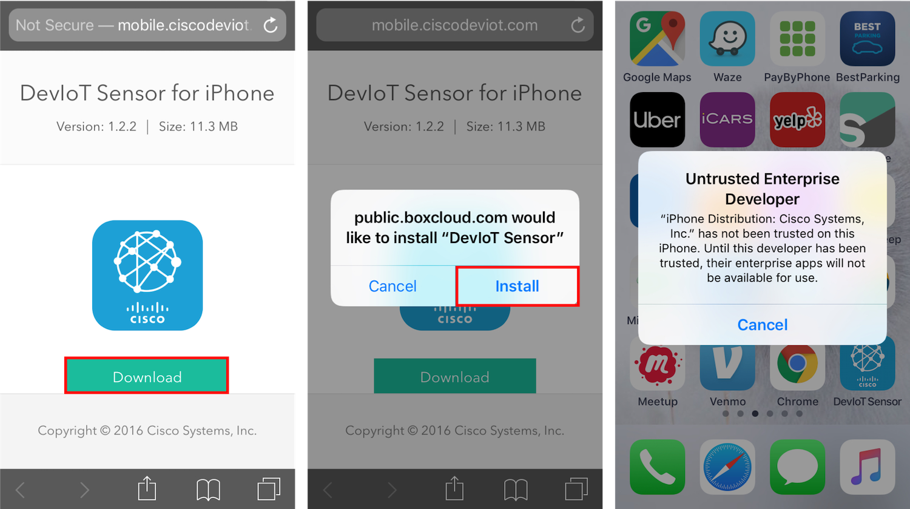
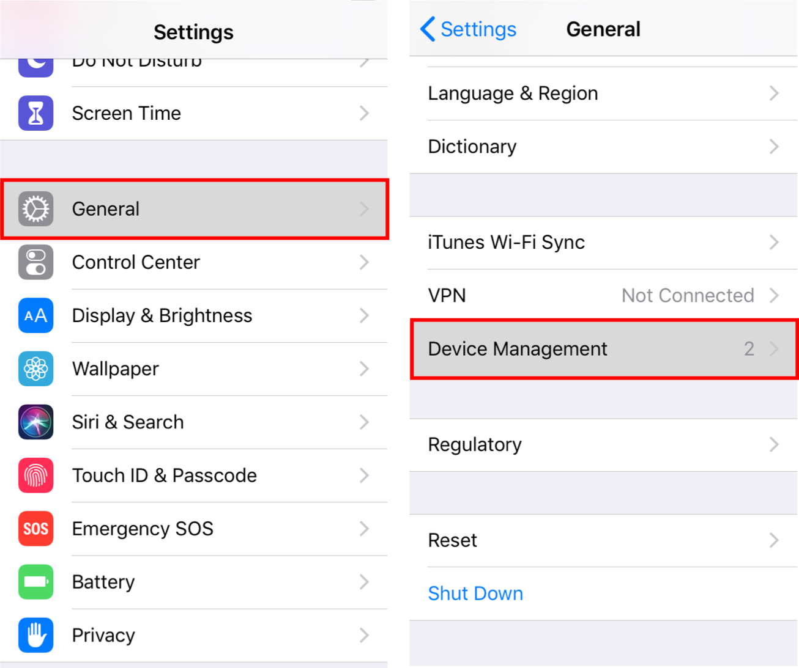
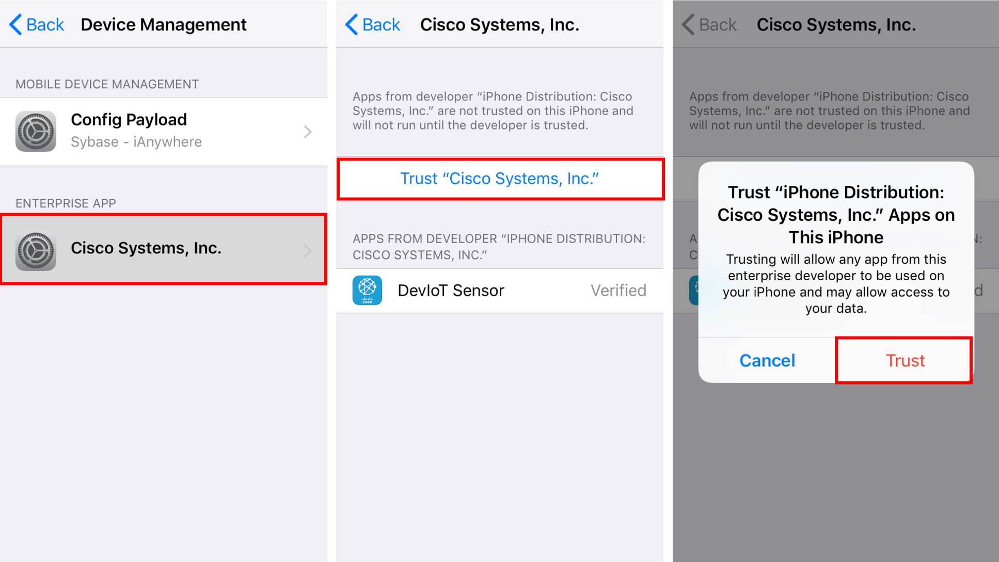
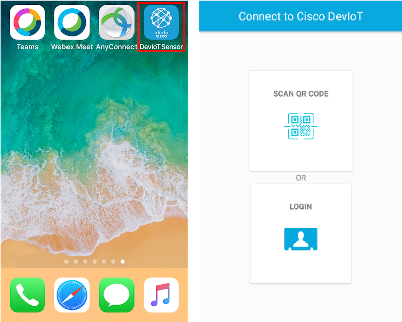

# Install DevIoT app on an iOS device
Because DevIoT app is not on 'App Store'. is is necessary to change a setting to install the app.

### 1. Download DevIoT iOS app on [https://deviot.cisco.com/mobile/](https://deviot.cisco.com/mobile/)
As you click the 'Download' button on [https://deviot.cisco.com/mobile/](https://deviot.cisco.com/mobile/), the install message will be popped up. If you click the 'Install' button on the popup message, the app will be installed *automatically*. 

Then you will see the 'Untrusted Enterprise Developer' message like the picture above right. You need to trust "Cisco Systems" as an enterprise developer in the next step.

### 2. Trust "Cisco Systems, Inc." in Settings

Go to **Settings > General > Device Management**.

Click 'Cisco Systems, Inc' and choose to trust "Cisco Systems, Inc.". This only allows using the app developed by "Cisco Systems, Inc." in your iPhone.

### 3. Launch DevIoT app
You can find 'DevIoT Sensor' app icon. Check whether the app works well.

As you see, there are two buttons connecting to DevIoT on home: '**SCAN QR CODE**' and '**LOGIN**'.

'**SCAN QR CODE**' button is the way to connect by scanning a QR code. It is explained on the next page '**Connect by scanning a QR code**'. '**LOGIN**' button is the way to connect by inputting data manually, which is described on the third page '**Manually connect**'.
