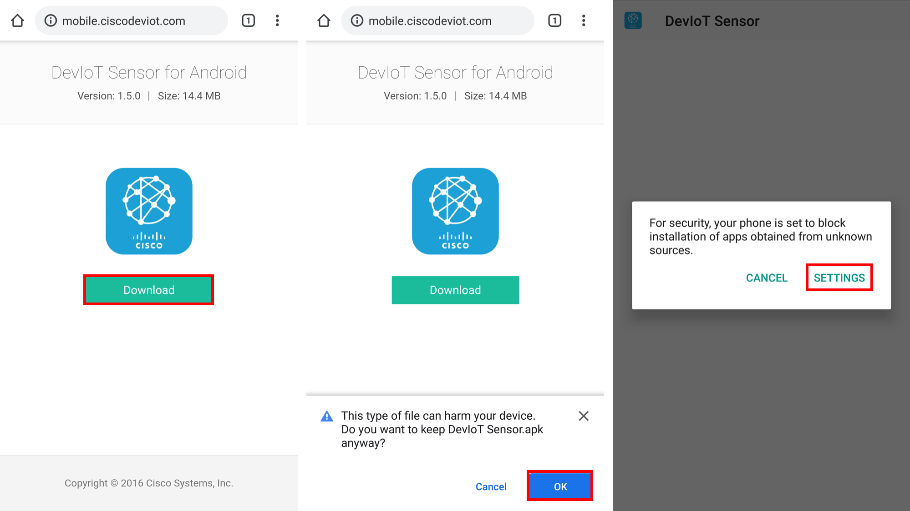
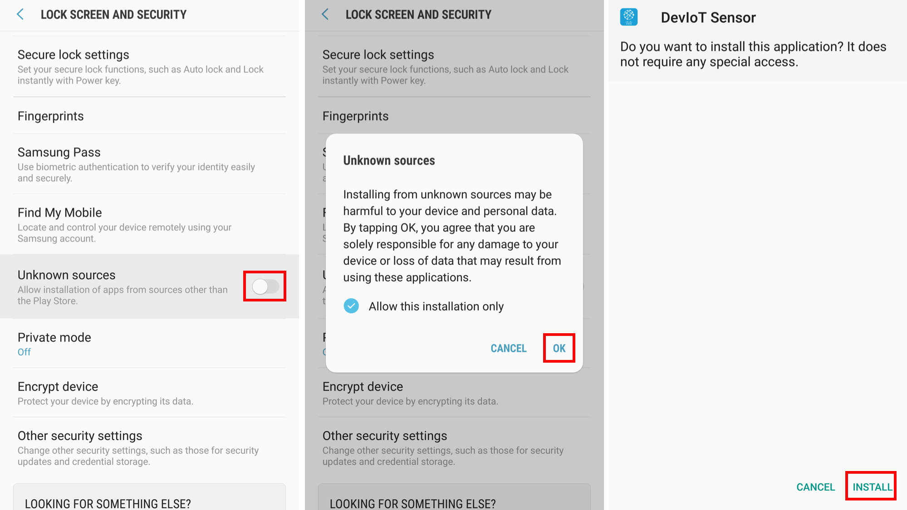
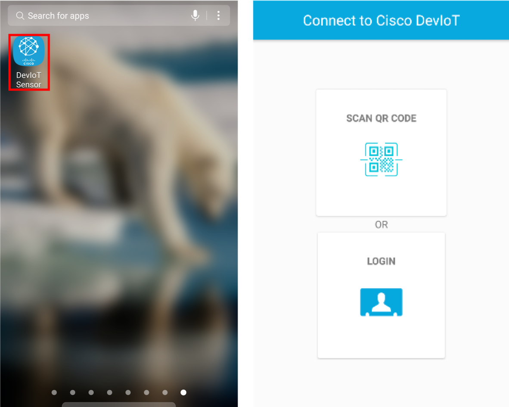

# Install DevIoT app on an Android device

Because DevIoT app is not on public app stores like "Google Play Store", the installation must be allowed in settings. The pictures are captured on Android 7.0 *Nougat*. Your mileage may vary.

### 1. Download DevIoT Android app on [http://mobile.ciscodeviot.com/](http://mobile.ciscodeviot.com/)

You can download the apk file (The file format for Android app installation) of DevIoT app by clicking the 'Download' button on [http://mobile.ciscodeviot.com/](http://mobile.ciscodeviot.com/). You may need to allow the download of the apk file. After downloading and open the apk file, you will see the warning message that phone blocks the installation of the app.

### 2. Allow installation of DevIoT app in settings

You should allow the installation of an app from unknown sources in settings. Go to **Settings > Lock Screen and security > Unknown sources** and allow unknown sources. It is better to check "Allow this installation only" for security.

### 3. Launch DevIoT app

DevIoT app will be installed and create an app icon. Open the installed DevIoT app.

As you see, there are two buttons connecting to DevIoT on home: '**SCAN QR CODE**' and '**LOGIN**'.

'**SCAN QR CODE**' button is the way to connect by scanning a QR code. It is explained on the next page '**Connect by scanning a QR code**'. '**LOGIN**' button is the way to connect by inputting data manually, which is described on the third page '**Manually connect**'.
