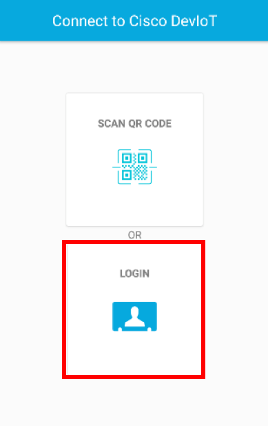
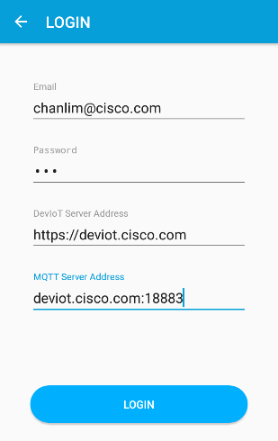
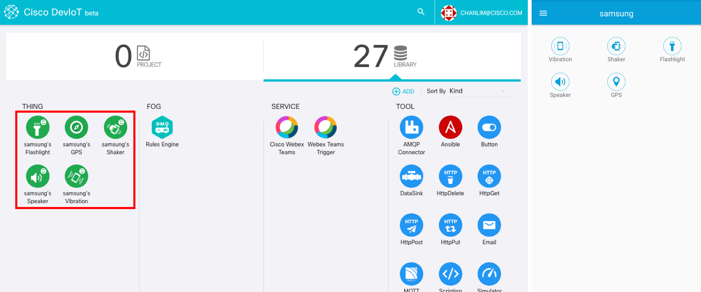

# Manually connect

If you cannot use a camera or encountered an error scanning QR code, you can use 'manual login'.

### 1. Click 'LOGIN' button on the app

### 2. Write down the information and click 'LOGIN' button
- Write your DevIoT account on the 'Email' tab. The account is on the sidebar in the DevIoT dashboard page, 
- Type any text for 'Password' because password is disabled now.
- Write 'https://deviot.cisco.com' or 'deviot.cisco.com' on 'DevIoT Server Address'
- 'MQTT Server Address' is 'deviot.cisco.com:18883'

After clicking 'LOGIN' button, the control page with sensor buttons is shown on your phone and you can see the new components on the dashboard page in DevIoT web. (You need to refresh DevIoT)

