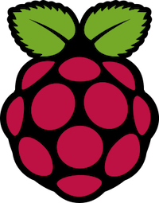
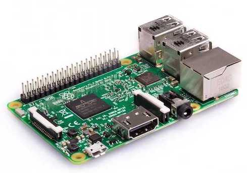
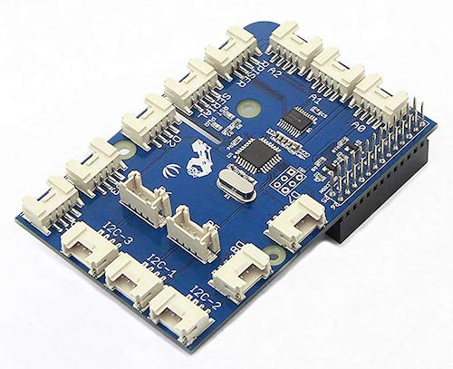

# Connect Raspberry Pi to DevIoT

Completion time: 30 mins

## Objectives
The objective of this lab is to learn how to:
**1**. Set up Raspberry Pi and GrovePi
**2**. Connect Raspberry Pi to DevIoT

## Prerequisite
This learning lab does not require you to write programming codes, but you need to type command on the terminal window. And DevIoT SDK is necessary to connect Raspberry Pi to DevIoT. Even though you can follow this learning lab without completing '**DevIoT: Part 3**', I recommend you to finish the learning lab.
 - ***[DevIoT: Part 1 - Introduction](https://developer.cisco.com/learning/lab/intro-deviot/step/1) (required)*** 
 - ***[DevIoT: Part 3 - Build a gateway using SDK](https://developer.cisco.com/learning/lab/sdk-deviot/step/1) (recommended)** 

## What is Raspberry Pi?
 

The **[Raspberry Pi](https://www.raspberrypi.org/)** is a small single-board computer. Since its portability and low cost, it is widely used for embedded computing or educational purpose. The Raspberry Pi uses the Unix-like operating system (OS) called **Raspbian**, which is a combination of Raspberry Pi and Debian (a kind of Unix-like OS). Since the Raspberry Pi contains only board without input and output devices, you need to bring input devices like a keyboard and a mouse, and a display device with an HDMI cable.

## What is GrovePi?

The **[GrovePi](https://www.dexterindustries.com/grovepi/)** is the board to connect Grove sensors to a Raspberry Pi board. The company *Dexter Industries* has made this board and sensors to make it easy to control them with embedded computers like Raspberry Pi. Raspberry Pi can get data from these sensors or control them by typing easy. There are many kinds of Grove sensors like a button, a distance sensor, a temperature sensor and so on. We will connect these sensors to DevIoT.
