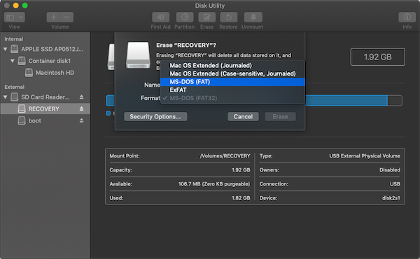
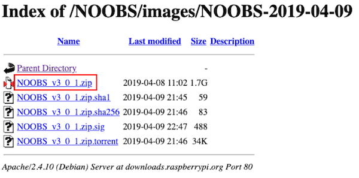
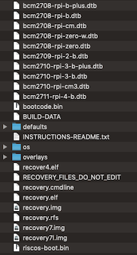
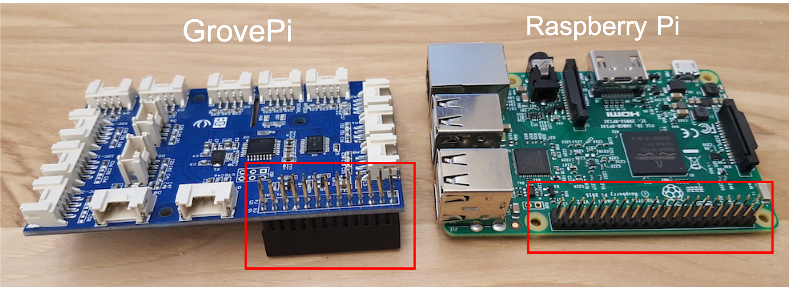
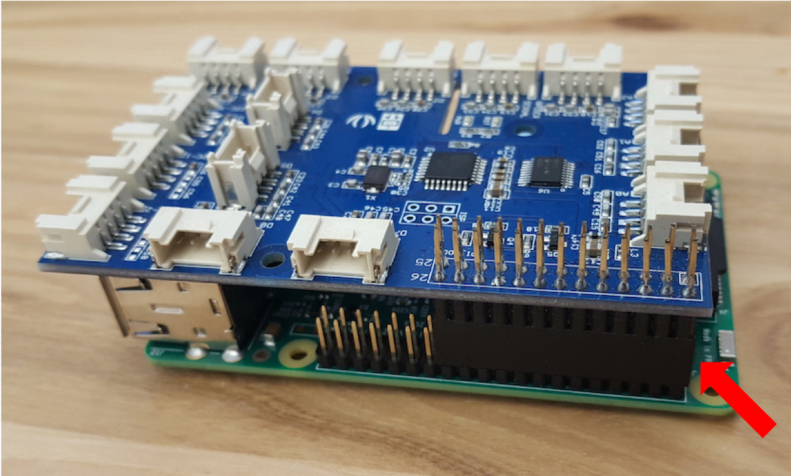
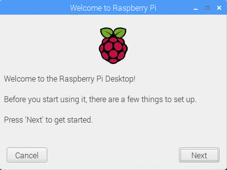

# Set up Raspberry Pi
## Load Raspbian (Raspberry Pi OS) on an SD card

If your SD card is preloaded with Raspbian or NOOBS, then you can skip this page. But if not, you need to install Raspbian on the SD card.

### Requirements of an SD card
#### Physical size
First, an SD card's physical size should be appropriate to your Raspberry Pi. The original versions of Raspberry Pi like Model A and B need full-size SD card. The newer versions require microSD cards.

#### Capacity
The minimum recommended card size for Raspbian is **8GB**, and for Raspbian Lite is 4GB. I recommend 8~32GB SD card.

#### Format
The SD card for Raspberry Pi must be formatted to FAT16 or FAT32. The Raspberry Pi cannot boot the SD card with the exFAT format.

On a Mac, you can use the 'Disk Utility' program. Select your SD card and click 'Erase' button. Choose '**MS-DOS (FAT)**' on 'Format' tab.

### Install Raspbian on the SD card

There are two options to install Raspbian on your SD card: 
(1) Install the OS image on the card 
(2) Install the installer (**NOOBS**) of a Raspbian image. 
I recommend the second option, NOOBS. It is very easy. The only thing to do is extracting the installer file to the card.

#### 1. Go to http://downloads.raspberrypi.org/NOOBS/images/NOOBS-2019-04-09/ and download the ZIP file of NOOBS

The latest version (buster) is on https://www.raspberrypi.org/downloads/noobs/. But Raspberry OS is usually not stable right after its first release. So I recommend using the second version (stretch) to the lastest.

#### 2. Extract Zip file to the SD card
The files compressed in the Zip file (the files below) should be extracted to the **root** directory of the SD card.

## Mount a GrovePi board on a Raspberry Pi

When you connect a Raspberry Pi board and a GrovePi board, you need to use pin GPIO headers. Pin headers are in the bottom right boxes of the below picture. Raspberry Pi boards come with a 40-pin header, while GrovePi boards come with a 26-pin header.

When you mount the GrovePi board on the Raspberry Pi board, you must be careful that the ends of both pin headers are aligned. Refer the arrow of the below picture. If they are combined incorrectly, it can cause damage to the boards.

## First boot Raspberry Pi
Plugin your keyboard, mouse, and monitor, and power up your board. And then the Raspberry Pi will boot. The setup wizard for Raspbian will appear on the monitor. Follow the wizard.

