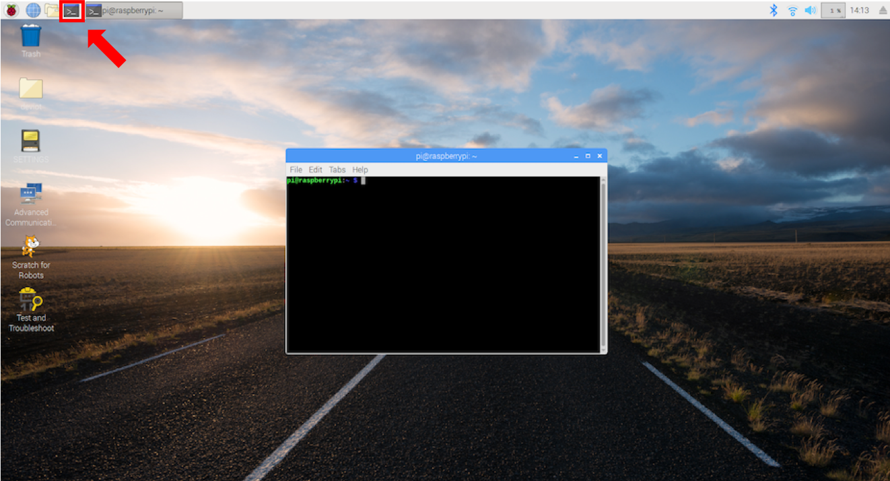

#  Install GrovePi SDK and DevIoT SDK on Raspberry Pi
We finish preparing Raspberry Pi. Now we will download GrovePi SDK and DevIoT SDK. We will use the 'Terminal'.

Open the terminal. It is on the sidebar with the box-shaped icon, or go to **Start Menu** (click the top leftmost Raspberry-shape icon) **> Accessories > Terminal**.

Before starting this part, make sure that your Raspberry Pi is connected to the **Internet**. 

## Install GrovePi SDK
Type the following commands in the terminal window. 

    sudo apt-get update
    sudo apt-get install rpi.gpio

`sudo` is the command for executing the following command with administrator permission. `apt-get` is the command-line tool for managing installed packages in Unix-like OS.

Set up the software.

    curl -kL dexterindustries.com/update_grovepi | bash
    sudo reboot

And then flash the firmware.

    cd ~/Dexter/GrovePi/Firmware
    bash firmware_update.sh

Check the firmware version and make sure that the version is 1.4.0 or higher.

## Install DevIoT SDK

As explained in the previous learning lab [DevIoT: Part 3](https://developer.cisco.com/learning/lab/sdk-deviot/step/1), download and install DevIoT Python SDK. Before installing the SDK, change the current directory with the one you want.

    git clone https://github.com/CiscoDevIoT/gateway-python-sdk.git
    cd gateway-python-sdk
    python setup.py install

And download the pre-built gateway for Grove sensors. It is similar to *[python-gateway-starter-kit](https://github.com/CiscoDevIoT/gateway-python-starter-kit)* we handled in the previous learning lab.

    cd ../
    git clone https://github.com/CiscoDevIoT/gateway-python-grovepi.git
    cd gateway-python-grovepi

Now we have done all the installation part.
