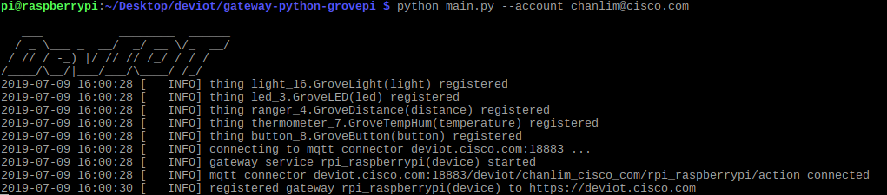
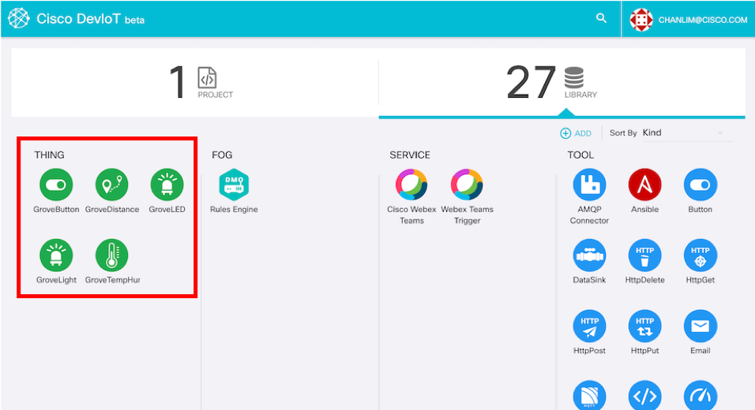
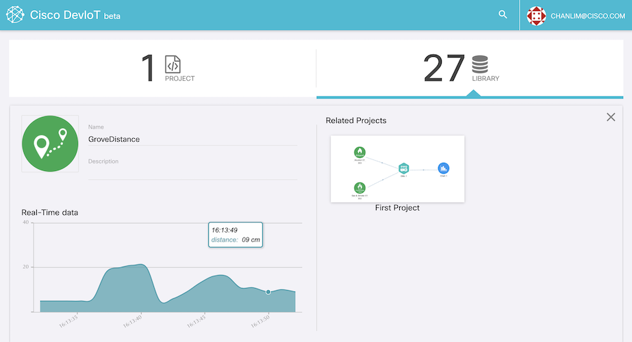

# Connect Raspberry Pi to DevIoT

The *gateway-python-grovepi* directory has the following structure. It is almost same with *gateway-python-starter-kit*.

    gatweay-python-grovepi
    |-cisco_grovepi
        |-sensor.py
        |- ...
    |-main.py
    |-sensors.json

The *cisco_grovepi* directory contains the pre-defined gateway classes for controling Grove sensors. *main.py* is the main file to connect sensors to DevIoT. And *sensors.json* file is the configuration file to set the gateways connected to DevIoT. 

## Edit a config file.

Before executing main.py, you need to edit *sensors.json* to input the types and pin numbers of sensors. JSON is the file format which human can easily read.

In *sensors.json* file, 
```
{
    "type": "light",
    "pin": "A2",
    "name": "GroveLight",
    "options": {}
}
```
these structures repeat. Each braket means a sensor to add onto DevIoT. 

In a brace, **type** is the file name of the sensor class in *cisco_grovepi* directory. For example, 'light' is for the light sensor, 'ranger' is for the distance sensor. The sensor type that the sensor class implements is written on the comment of each class file. 
**pin** is the pin number where the sensor is connected on the GrovePi board. It should be a type like "A1" or "D2". (A means analog, D means digital) It is written on the GrovePi board.
**name** is the display name which will be shown on DevIoT. **options** is for the additional setting when you make the custom sensor class. But 'options' is not necessary. You can omit it or left with {}.

Edit sensors.json file according to your configuration of the Raspberry Pi board.

## Run

Replace *`your_id@cisco.com`* in the command below with your DevIoT account.

    python main.py --account your_id@cisco.com

If it is successful to connect the Raspberry Pi sensors to DevIoT, the result would be like the following picture.



Let's check on the DevIoT web. You can see that 5 gateways for sensors are newly created.



If you click one of them, you will see DevIoT get the real-time data from the sensor. (There would be 1~2 seconds delay.)



In order to disconnect the Raspberry Pi, press Ctrl and C buttons on the terminal window. It causes a keyboard interrupt.