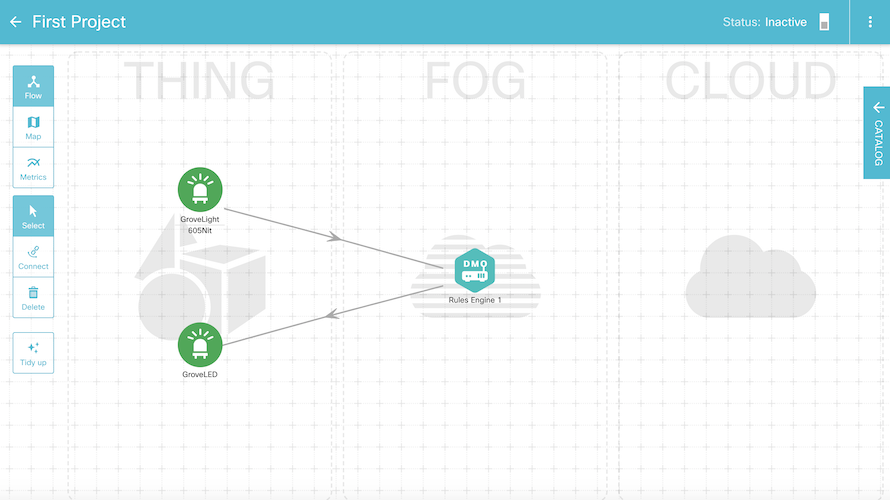
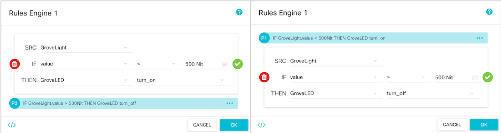

# Make an IoT program using Raspberry Pi

In this page, we will make a simple IoT program using Raspberry Pi sensors. Even if you don't have the sensor used in this page, you can refer this page to build your program.

The program will send turn a LED on if the environment becomes dark (the brightness is lower than the certain value), and vice versa.

### 1. Drag-and-drop components

Create a new project and drag-and-drop '**GroveLight**', '**GroveLED**', and '**Rules Engine**' to the workspace like the figure below. 

### 2. Set rules

Click 'Rules Engine' and set rules. 
Set source (SRC) as '**GroveLight**' and the condition as "If the value is lower than 500 Nit". The value '500 Nit' is just an example. It should be smaller than the value at a normal codition and be bigger than a dark condition. And finally, the result (THEN) should be turning on '**GroveLED**'. In the same way, set the rule to turn off the LED if the brightness is higher than 500 Nit.

### 3. Activate the project and Test

Activate the project by clicking the right button on the sidebar. Let's test our program. The video below shows how the real sensors work. The left sensor is a light sensor. As I cover the sensor with DevNet sticker, the LED turns on and vice versa.

If we use a smart bulb instead of GroveLED, we can build the program controlling the bulb according to the brightness of a room.
