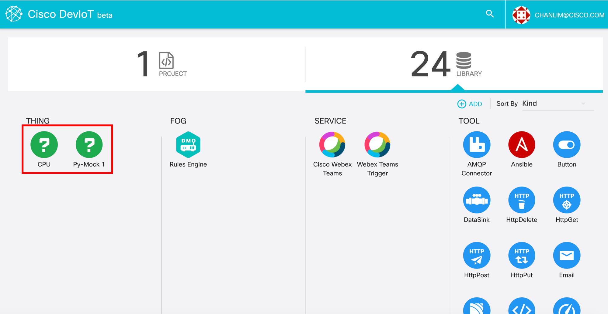

# Run a sample code

In this step, you will learn how to use **[DevIoT Python SDK](https://github.com/ailuropoda0/gateway-python-sdk)** and **[DevIoT Python Starter Kit](https://github.com/ailuropoda0/gateway-python-starter-kit)**.

## 0. Check environment
We will utilize *Terminal* from this point. Git and Python are requirements.

#### check whether Git is installed
We will use git to download SDK and starter-kit. (You can also download a ZIP file from the GitHub pages)
```
git --version
```
If git is not installed, there will be an error message "git: command not found" or a popup message about installing command line tools. 

#### check version of Python
DevIoT Python SDK and starter-kit are written in **Python 2.7**. The version of Python should be 2.7.3 or higher. The default version of python in mac is Python 2.7.

```
python --version
```
The version of Python should not be 3.x. If the version of Python is 3.x, try 'python2' instead.


## 1. Install SDK and Download Starter-kit
Download SDK git repo
```
git clone https://github.com/ailuropoda0/gateway-python-sdk.git
cd gateway-python-sdk
```

install the SDK package on Python
```
python setup.py install
```

Download Starter-kit
There are 2 options to download starter-kit. If you just want to try starter-kit, download gateway-python-starter-kit. If you want to build your app and manage your code continuously, fork gateway-python-starter-kit to your Github account.
```
cd ../
git clone https://github.com/ailuropoda0/gateway-python-starter-kit.git
```

Starter-kit uses 'psutil' package. 
```
pip install psutil
```

## 2. Look over Starter-kit
This is the structure of Starter-kit directory.
```
things
|- cpu.py
|- mock_beeper.py
main.py
things.json
```
- **things** directory
'things' directory contains the class for your thing. cpu.py and mock_beeper.py in this directory are pre-built thing classes. If you want to make your own class, you should define your class or modify these classes in this directory. Each class has to inherit **Thing** class in *cisco_deviot.thing* package. The class name should be the capitalized name of python file like 'Cpu' class in cpu.py.
    - Cpu (Input): get the CPU and memory usage from a device
    - Mock_beeper (Output): print "Beep" messages  in a device

- **main.py**
main.py is the main file to run the instances of your thing class and connect them to DevIoT. You can change the location of classes and the name of a config file in this file.

- **things.json**
things.json is a configuration file setting which things are registered on DevIoT. It should be a JSON file. JSON is a file format to transfer data, which is easy to read and write.
    ```
    [
        {
            "type": "mock_beeper"
            "name": "Py-Mock 1"
            "option": {}
        },
        {
            "type": "cpu",
            "name": "CPU"
        }
    ]
    ```
    Thing instances, which are given inside {}, are listed in []. A thing instance becomes a componenent(icon) on DevIoT. Each instance should have **"type"** and **"name"**. 
    **"type"** is the type of the thing instance and it should be one of pre-defined class or **"thing"**. If you don't want to define class, you are able to choose "thing" and define the characteristics in main.py.
    **"name"** is a display name on DevIoT. If "name" is omitted, the default value, device name + "'s " + type, is set.
    **"option"** is for setting initial values. You can transfer some values through "option". "option" is not used in start-kit but we will use it in Step 4. 

## 3. Run Starter-kit
Run main.py with the argument of your DevIoT account.

```
cd gateway-python-starter-kit
python main.py --account your_deviot_id@mail.domain
```
If you want to connect your gateway to your private DevIoT server, then add '--deviot-server' and '--mqtt-server' arguments.

To stop the gateway, press Ctrl and C button.

## 4. Check the connection
After running main.py, you can see these logs in a terminal. If there is any error log, there might be a problem to connect to DevIoT.


You can find two components newly added on DevIoT.



If you click 'CPU' icon, you can see real-time data on CPU usage and memory usage of the PC running the main file.


And after clicking 'RUN' button on 'Py-Mock 1' test page, you will get '[BEEP]' message once a second for 10 seconds.


