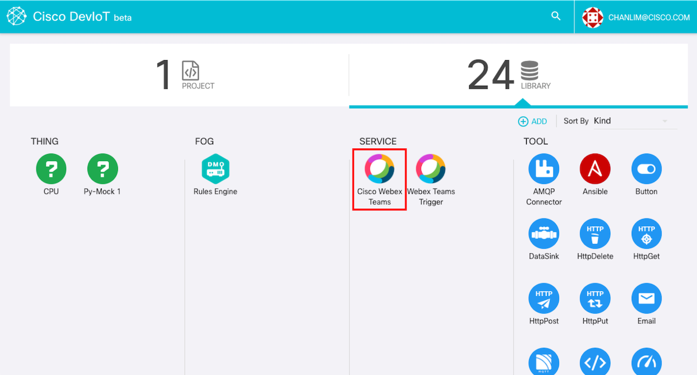
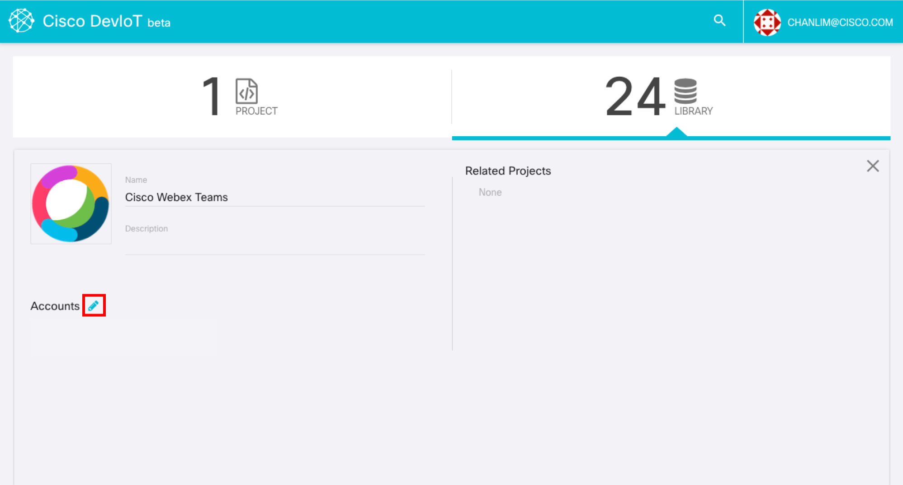
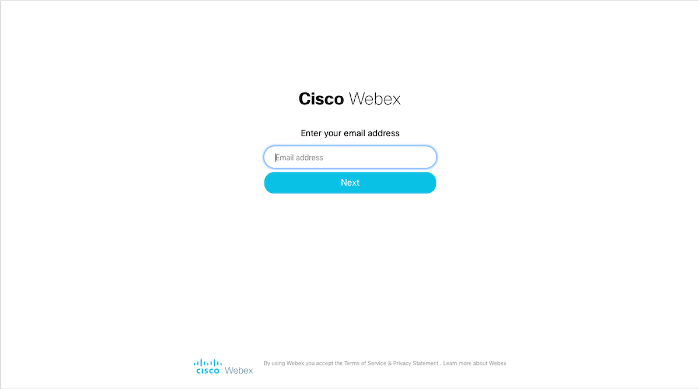
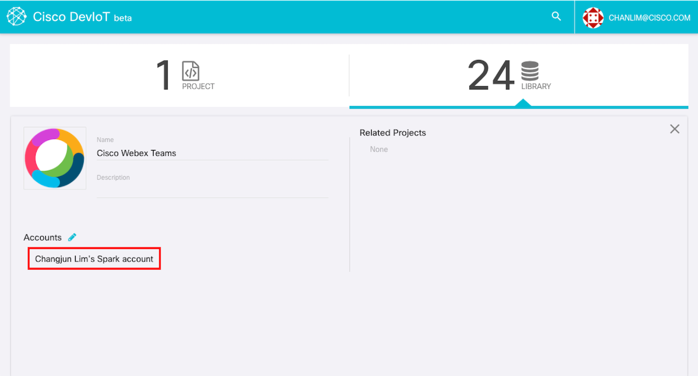
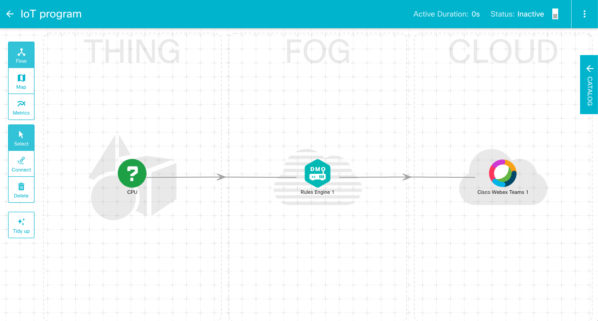
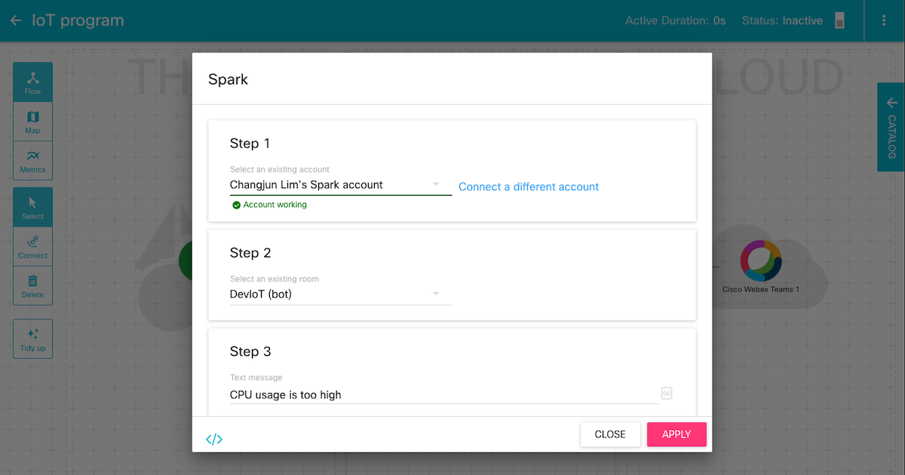
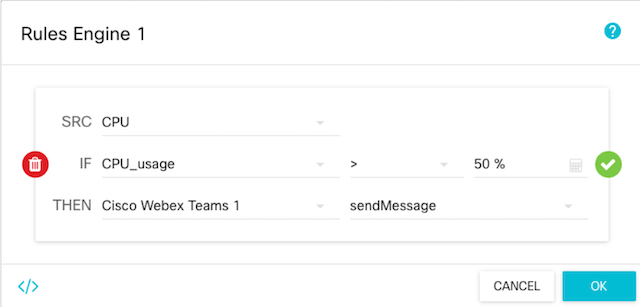
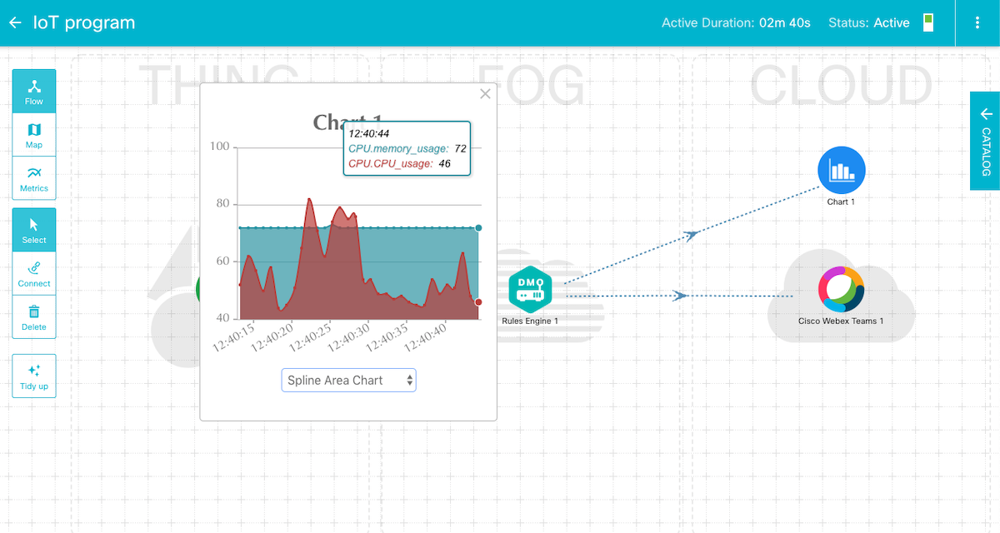

# Build an IoT program

We will make an IoT program which sends a WebEx Teams message if your CPU usage is over 50%.

## Run starter-kit
Before running the command, replace 'your_deviot_id@mail.domain' with your DevIoT account.
```
python main.py --account your_deviot_id@mail.domain
```
## Connect WebEx Teams
Click 'Cisco Webex Teams' icon, then Webex Teams page is popped up. Click a pencil button next to 'Accounts' and click 'Add' button.




Then DevIoT is redirected to the Cisco Webex login page. If you login Webex, or enter your address(if you are running Webex Teams), your account will be connected.





## Build an IoT program
Open your project and drag-and-drop 'CPU', 'Rules Engine' and 'Cisco Webex Teams' component.



Click 'Cisco Webex Teams' component and set a chatroom and a message to send.



And click 'Rules Engine' and set the rule to send Webex Teams message if CPU usage is over 50%.



Activate your project and test the program. You can see that the Webex message was sent.




## Conclusion
In this learning lab, We have learned how SDK and Starter-kit works and made the IoT program using SDK and starter-kit. Now you can make your own gateway easily with Starter-kit. The only thing you need to code is how an input component gets its variables and how an output component acts when called. SDK and Starter-kit give you more possibility to develop the components which DevIoT does not provide.
